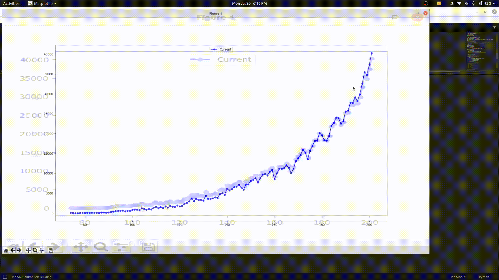

# COVID-19 Visualize

Visualising COVID-19 data of INDIA using API from covid19india.org

- Get all the relevent data at State & National Level using:

```bash
wget https://api.covid19india.org/states_daily.json
```

<

<!-- https://s4.ezgif.com/save/ezgif-4-6124051f4309.gif -->